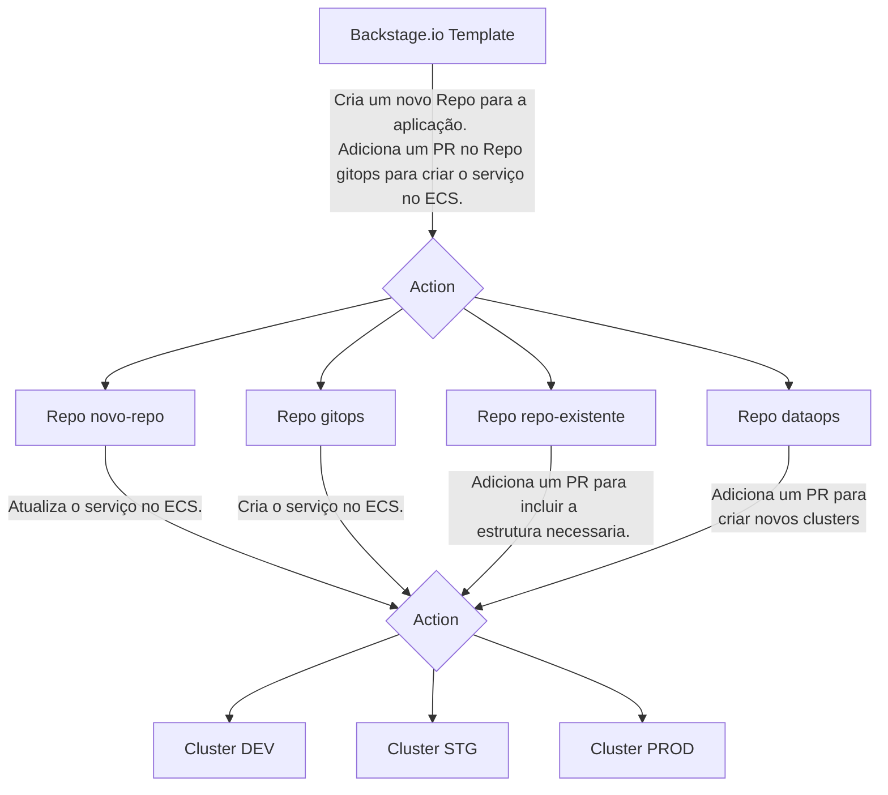

# [Backstage.io](https://backstage.io)

Alimentado por um catálogo de software centralizado, o Backstage restaura a ordem em sua infraestrutura e permite que suas equipes de produto enviem códigos de alta qualidade rapidamente, sem comprometer a autonomia.

- [Node](https://nodejs.org/en)
- [nvm](https://github.com/nvm-sh/nvm)
- [Docker](https://www.docker.com/)
- [Postgres](https://www.postgresql.org/)

Para setar a versão do node, use o comando abaixo.

```sh
$ nvm use
```

É necessario instalar os pacotes:
```sh
$ yarn install
```

Para rodar a aplicação.
```sh
$ yarn dev
```


