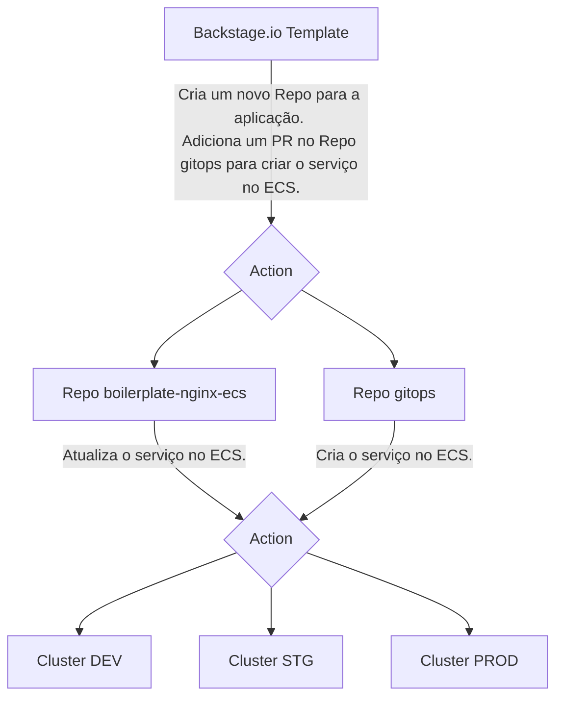

## ${{ values.name }}

```mermaid
flowchart TD;
    B[Backstage.io Template] -->|Cria um novo Repo para a aplicação. <br>Adiciona um PR no Repo gitops para criar o serviço no ECS.| C{Action}
    C --> D[Repo gitops];
    C --> E[Repo boilerplate-nginx-ecs];
    D[Repo boilerplate-nginx-ecs] -->|Atualiza o serviço no ECS.| J{Action}
    E[Repo gitops] -->|Cria o serviço no ECS.| J{Action}
    J --> K[Cluster DEV];
    J --> L[Cluster STG];
    J --> M[Cluster PROD];
```
